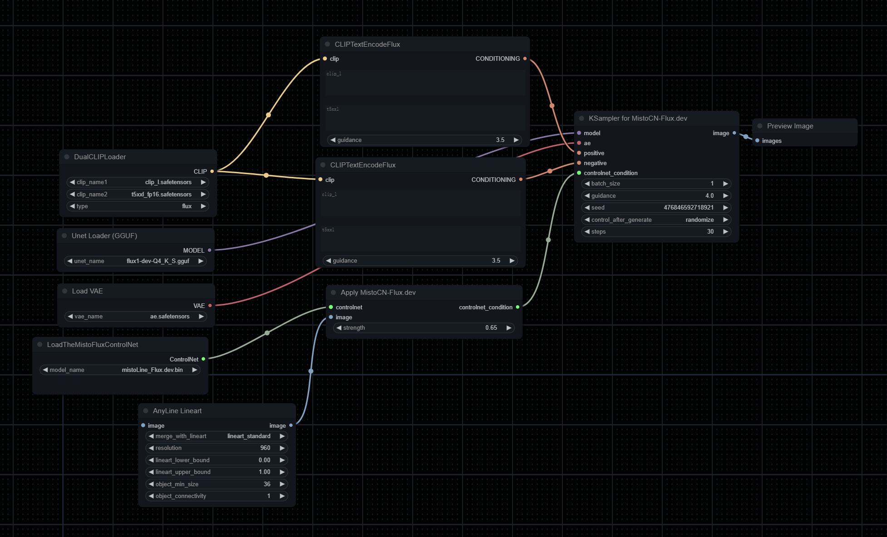

[中文版-README](README_CN.md)
## VERY IMPORTANT
<mark>!!!Please update the ComfyUI-suite for fixed the tensor mismatch promblem.  
!!!please donot use AUTO cfg for our ksampler, it will have a very bad result.   
!!!Strength and prompt senstive, be care for your prompt and try 0.5 as the starting controlnet strength
!!!update a new example workflow in workflow folder, get start with it.<mark> 

# New Update!
We have just launched our latest product, Misto.
The most powerful AI Mind Palace built for all designers.
Warmly welcome everyone to try it out.
Website: https://themisto.ai/  

## Summary
by TheMisto.ai @Shenzhen, China  
This is a ControlNet network designed for any lineart or outline sketches, compatible with Flux1.dev. The ControlNet model parameters are approximately 1.4B.  

This model is not compatible with XLabs loaders and samplers. Please use TheMisto.ai Flux ControlNet ComfyUI suite.
This is a Flow matching structure Flux-dev model, utilizing a scalable Transformer module as the backbone of this ControlNet.  

We've implemented a dual-stream Transformer structure, which enhances alignment and expressiveness for various types of lineart and outline conditions without increasing inference time. The model has also been trained for alignment with both T5 and clip-l TextEncoders, ensuring balanced performance between conditioning images and text prompts.   
For more details on the Flux.dev model structure, visit: https://huggingface.co/black-forest-labs/FLUX.1-dev  

This ControlNet is compatible with Flux1.dev's fp16/fp8 and other models quantized with Flux1.dev. ByteDance 8/16-step distilled models have not been tested.  
- The example workflow uses the flux1-dev-Q4_K_S.gguf quantized model.  
- Generation quality: Flux1.dev(fp16)>>Flux1.dev(fp8)>>Other quantized models
- Generation speed: Flux1.dev(fp16)<<< Flux1.dev(fp8) <<< Other quantized models

## Performance
### Performance Across Different Sizes and Scenarios
Tested in various common scenarios such as industrial design, architecture, interior design, animation, games, and photography.  
Make sure to craft your prompts well—precision is more important than length!  
Performance examples are shown below:  
  

### Performance with Different Lineart or Scribble Preprocessors
Test Parameters:  
- Prompt: "Hyper-realistic 3D render of a classic Formula 1 race car, bright red with Marlboro and Agip logos, number 1, large black tires, dramatic studio lighting, dark moody background, reflective floor, cinematic atmosphere, Octane render style, high detail"
- controlnet_strength: 0.650.8 (Recommended: Anyline with 0.60.7)
- steps: 30
- guidance: 4.0
- The quality of generated images is positively correlated with prompt quality. Controlnet_strength may vary for different types of lineart and outlines, so experiment with the settings!
 

### Recommended Settings
- Image resolution: 720px or above on the short edge
- controlnet strength: 0.6~0.85 (adjust as needed)
- guidance: 3.0~5.0 (adjust as needed)
- steps: 30 or more

## Huggingface (抱抱脸):
[MistoLine_Flux.dev_v1](https://huggingface.co/TheMistoAI/MistoLine_Flux.dev)

## Usage
- Download the model from [MistoLine_Flux.dev_v1](https://huggingface.co/TheMistoAI/MistoLine_Flux.dev)
- Place the model in the ComfyUI\models\TheMisto_model\ directory
- The directory will be automatically created the first time you run the ComfyUI's TheMisto.ai Flux ControlNet ComfyUI suite
- Run using ComfyUI; an example workflow can be found in the workflow folder
- Note: The length and width of the conditioning image must be divisible by 16, or an error will occur.
### ComfyUI
 

## Training Details
The Transformer structure, under the scale law, has a significant impact on training time and computational power (higher compute cost, longer training time).   
The training cost for MistoLine_Flux1_dev is several times that of MistoLineSDXL.
We conducted extensive ablation experiments to balance performance with training costs.  
This training was done using A100-80GB with bf16 mixed precision on the Flux1.dev series models. Apart from Lora, consumer-grade GPUs are basically unsuitable for training.  
In our experiments with larger parameter models, multi-GPUs, multi-node parallel training was required, which is costly.  
If we reach 50,000 stars, we will open-source the Technical Report detailing more training details.

## License
Align to the FLUX.1 [dev] Non-Commercial License  
This ComfyUI node falls under ComfyUI  
This model is for research and educational purposes only and may not be used for any form of commercial purposes.  

## Business Cooperation
For any custom model training, commercial cooperation, AI application development, or other business collaboration matters, please contact us.  

- *Business:* info@themisto.ai

## Media
### International:
Website: https://themisto.ai/  
Discord: https://discord.gg/fTyDB2CU  
X: https://x.com/AiThemisto79359  

### Mainland China (中国大陆):
*Website:* https://themisto.ai/  
*WeChat Official Account:* TheMisto AI (Shenzhen Mixed Tuple Technology Co., Ltd.)  
*Xiaohongshu:* TheMisto.ai (Xiaohongshu ID: 4211745997)  
