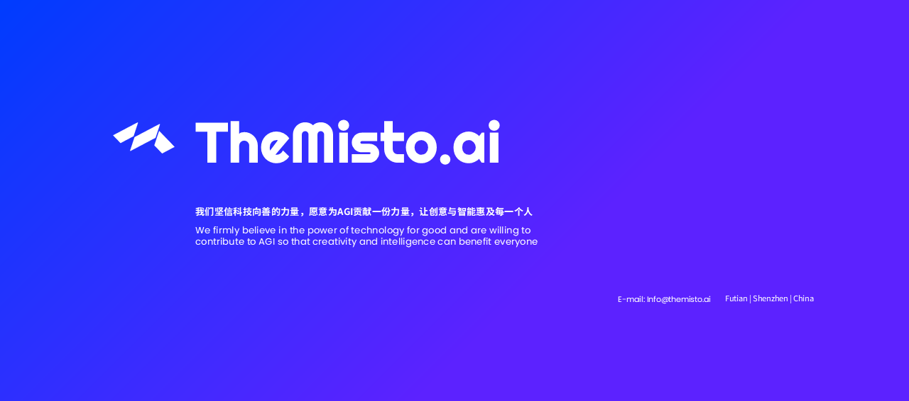

  
## 概述
by TheMisto.ai @Shenzhen, China  
针对Flow matching结构的Flux-dev模型，使用了可scale的Transformer model来作为本ControlNet的骨干网。  

从结构上，大体遵循@lllyasviel，对ControlNet的设计思想，使用零初始化后逐步引入ControlNet的影响。
该CN是双流架构，与Flux模型设计初衷一致，为日后更多模态作为CN的输入留下可能性。

受到SD3的CN和XLabs的启发，通过scalable的一些模块将会在日后的开源项目或模型中进行多方面的尝试，以试验效果与计算资源的平衡。目前可能需要通过对部分qkv进行优化以加快模型运行速度。 

本ControlNet适用于Flux1.dev的fp16/fp8以及其他量化模型。

### 与其他轮廓线相关的表现

### 推荐参数

## 模型

### Huggingface（抱抱脸）:

### 中国（大陆地区）便捷下载地址:

## 用法

### ComfyUI

## 训练细节
Transformer 结构的引入和scale law将会对训练时间和算力产生巨大影响，MistoLine_Flux1_dev的训练成本为MistoLineSDXL约2.5倍。
本次训练使用了A100-80GB，bf16的混合精度，图片精度略低于MistoLine-SDXL。  
如果需要在更高分辨率的训练集上进行训练，需要考虑分布式训练以及优化训练代码。

## 许可
Align to the FLUX.1 [dev] Non-Commercial License
This ComfyUI node fall under ComfyUI
本模型仅供研究和学习，不可用于任何形式商用

## 特别感谢
XLabs https://xlabs.by/
@lllyasviel

## Business Cooperation（商务合作）
For any custom model training, commercial cooperation, AI application development, or other business collaboration matters.  
please contact E-mail info@themisto.ai  

如果有任何模型定制训练，商业合作，AI应用开发等商业合作事宜请联系。   
电邮：info@themisto.ai

## WIP
Flux-dev-MistoCN-collection  
Flux-dev-Finetune and SFT

## One more thing

## 媒体
### 国际化:  
website: https://www.themisto.ai/

### 中国大陆地区: