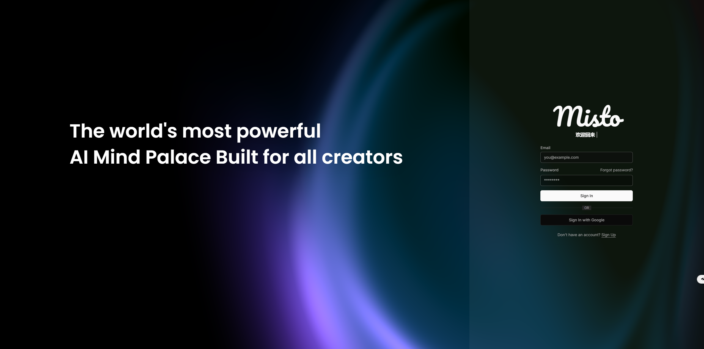

  
## 概述
by TheMisto.ai @Shenzhen, China  
这是一个适用于任意线稿、轮廓用于Flux1.dev的ControlNet网络，本ControlNet参数约为1.4B。  
本模型不兼容XLabs的加载和采样器，请使用TheMisto.ai Flux ControlNet ComfyUI套件。  

这是一个Flow matching结构的Flux-dev模型，使用了可scale的Transformer 模块来作为本ControlNet的骨干网
这次我们使用了双流型Transformer结构，在不增加推理时间的情况下对不同类型的线稿和轮廓条件有更好的表现力和对齐效果，同时对T5和clip-l两个TextEncoder的文字对齐也得到了对应的训练，不会出现只对conditioning image有响应而对prompt对齐能力下降的问题，尝试做到条件图像和文本对齐都有较好的表现。Flux.dev模型结构等请浏览：https://huggingface.co/black-forest-labs/FLUX.1-dev

本ControlNet适用于Flux1.dev的fp16/fp8以及其他使用Flux1.dev量化的模型, 字节跳动8/16步蒸馏的没有测试过。  
示例Workflow使用的是flux1-dev-Q4_K_S.gguf量化的模型。  
生成质量：Flux1.dev(fp16)>>Flux1.dev(fp8)>>其他量化模型  
生成速度：Flux1.dev(fp16)<<< Flux1.dev(fp8) <<< 其他量化模型

### 效果
#### 不同尺寸和场景效果
测试了工业设计、建筑设计、室内设计、动漫、游戏、照片等常用场景。  
请好好写prompt，不是长，是要比较精确！  
效果如下：  
 

#### 不同类型的Lineart or scribble preprocessor
测试参数:
- Prompt: "Hyper-realistic 3D render of a classic Formula 1 race car, bright red with Marlboro and Agip logos, number 1, large black tires, dramatic studio lighting, dark moody background, reflective floor, cinematic atmosphere, Octane render style, high detail"
- controlnet_strength: 0.65~0.8  (推荐：Anyline with 0.6~0.7)
- step: 30
- guidance: 4.0 
- 生成效果跟prompt质量成正相关关系，不同类型的线稿、轮廓使用的controlnet_strength也可能不同，多试一下！
 

### 推荐参数
- 图像分辨率：720px 以上 短边 
- controlnet strength：0.6~0.85 （视情况调整）  
- guidance:3.0~5.0 （视情况调整）  
- step:30 以上

### Huggingface（抱抱脸）:
[MistoLine_Flux.dev_v1](https://huggingface.co/TheMistoAI/MistoLine_Flux.dev)

## 用法
- 从[MistoLine_Flux.dev_v1](https://huggingface.co/TheMistoAI/MistoLine_Flux.dev)下载模型
- 将模型放入到 ComfyUI\models\TheMisto_model\ 目录下
- 第一次运行ComfyUI的TheMisto.ai Flux ControlNet ComfyUI套件会自动创建该目录
- 使用ComfyUI运行，文件夹workflow下有example的workflow  
- 注意：条件图的长和宽必须能被16整除，否则会报错
### ComfyUI
 

## 训练细节
Transformer结构在scale law的背景下会对训练时间和算力产生巨大影响（更大的算力消耗，更多的训练时间），MistoLine_Flux1_dev的训练成本为MistoLineSDXL的数倍之多。我们做了大量的消融实验来确保效果与训练成本的平衡。     
本次训练使用了A100-80GB，bf16混合精度，Flux1.dev系列模型的训练，训练的话除了Lora之外基本可以告别消费级显卡。
在我们更大的参数量模型的实验中，需要使用多卡多节点并行训练，成本较大。  
标星到5万我们将开源Technical report，介绍更详细的训练细节。

## 许可
- Align to the FLUX.1 [dev] Non-Commercial License  
- This ComfyUI node fall under ComfyUI  
- 本模型仅供研究和学习，不可用于任何形式商用

## Business Cooperation（商务合作）
For any custom model training, commercial cooperation, AI application development, or other business collaboration matters.  
please contact us.  
- Business :info@themisto.ai  
- Investment: investment@themisto.ai

如果有任何模型定制训练，商业合作，AI应用开发等合作事宜请联系。
同时我们也欢迎投资者咨询更多信息。   
- 业务电邮：info@themisto.ai    
- 投资者关系：investment@themisto.ai

## WIP
- Flux1.dev-MistoCN-collection  
- Flux1.dev-Misto-IPAdapter  

你的start是我们开源的动力！

## One more thing
  
我们将会在最近推出我们自己的的产品：（一款极其简单易用的多模态AI创意创作APP - [Misto]）  
以最简单和启发性的体验，重新激发大众创作欲望      
创意触手可及，扩展想象力边界，让无限灵感成就超级个体！

支持平台：全平台  

## 媒体
### 国际化:  
website: https://themisto.ai/  
Discord：https://discord.gg/fTyDB2CU  
X：https://x.com/AiThemisto79359

### 中国大陆地区:
website: https://themisto.ai/  
wechat公众号：TheMisto AI（深圳混合元组科技有限公司）  
小红书：TheMisto.ai (小红书号：4211745997)